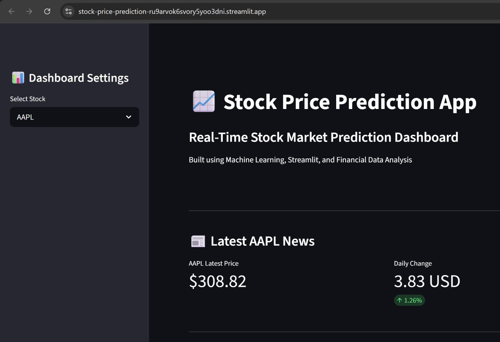
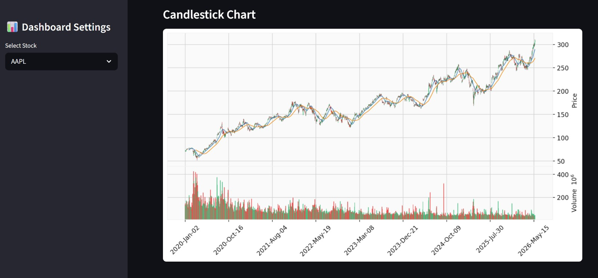
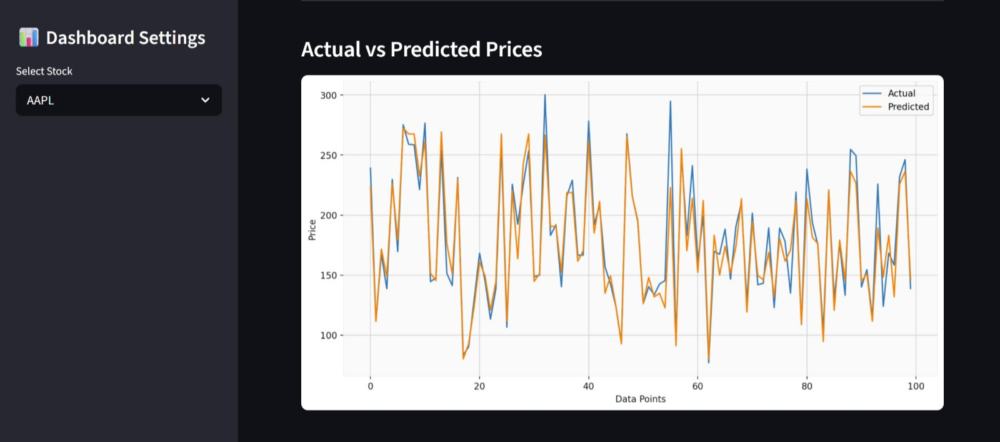
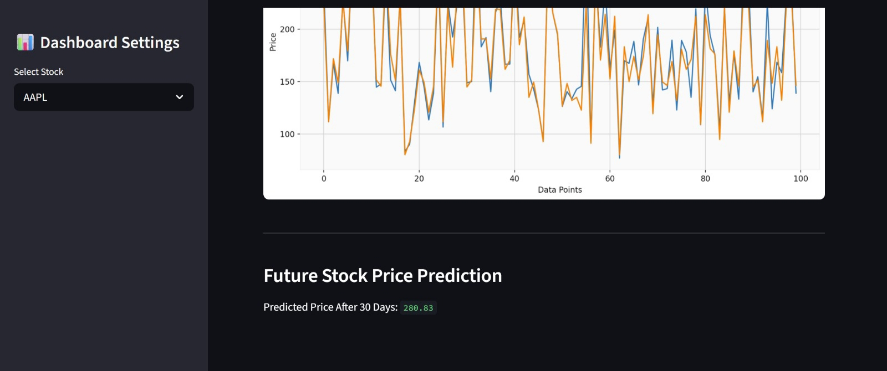
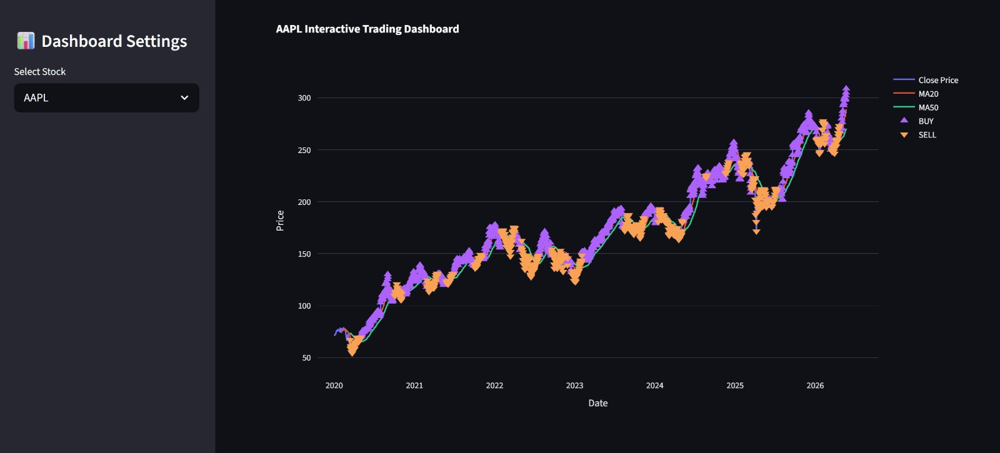
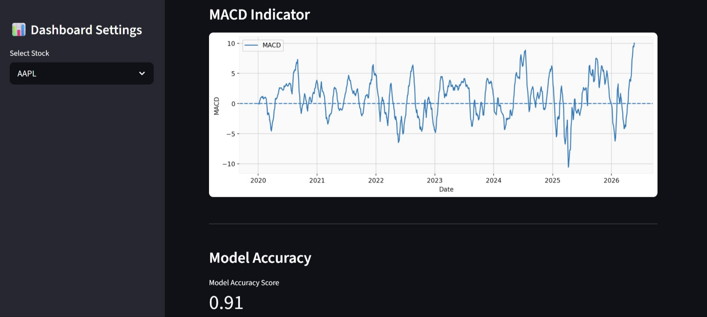
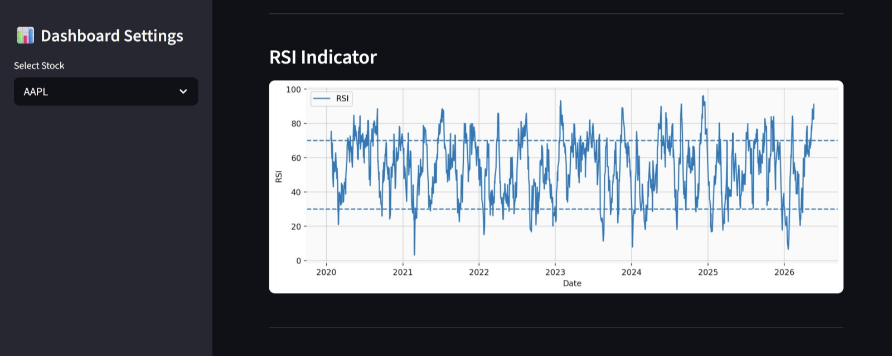
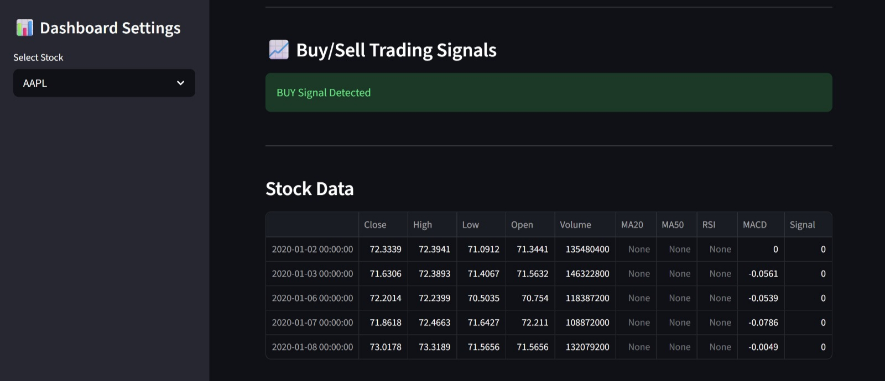

# 📈 AI-Powered Stock Market Prediction Dashboard

A real-time AI-powered stock market analytics dashboard built using Machine Learning, Streamlit, and financial data visualization techniques.

---

# 🚀 Live Demo

[Click Here to Open Dashboard](https://stock-price-prediction-ru9arvok6svory5yoo3dni.streamlit.app/)

---

# 📌 Features

✅ Real-time stock market data  
✅ AI-based stock price prediction  
✅ Interactive stock analytics dashboard  
✅ Candlestick chart visualization  
✅ Buy/Sell trading signal detection  
✅ RSI technical indicator  
✅ MACD technical indicator  
✅ Future stock price prediction  
✅ Interactive financial charts  
✅ Live stock market news integration  
✅ Auto-refresh dashboard  
✅ Machine Learning prediction system  

---

# 🛠️ Technologies Used

- Python
- Pandas
- NumPy
- Scikit-learn
- XGBoost
- Streamlit
- Plotly
- Matplotlib
- yFinance
- mplfinance
- Streamlit Autorefresh

---

# 📊 Dashboard Screenshots

## 🖥️ Main Dashboard



---

## 📈 Candlestick Chart



---

## 🤖 Actual vs Predicted Prices



---

## 🔮 Future Prediction



---

## 📊 Interactive Charts



---

## 📉 MACD Indicator



---

## 📈 RSI Indicator



---

## 🚦 Trading Signals



---

# 📂 Project Structure

```bash

stock-price-prediction/
│
├── images/
│   ├── dashboard.png
│   ├── candlestick_chart.png
│   ├── actual_vs_predicted.png
│   ├── future_prediction.png
│   ├── interactive_charts.png
│   ├── macd_indicator.png
│   ├── rsi_indicator.png
│   ├── trading_signals.png
│
├── app.py
├── streamlit_app.py
├── requirements.txt
├── README.md

---

# ▶️ Installation

git clone https://github.com/kanikagupta18silver-spec/Stock-Price-Prediction

cd stock-price-prediction

pip install -r requirements.txt

streamlit run streamlit_app.py

---

# ▶️ Run Application

streamlit run streamlit_app.py

---

# 📈 Machine Learning Workflow

- Data Collection using Yahoo Finance API
- Data Preprocessing using Pandas & NumPy
- Feature Engineering
- Moving Average Calculation
- Trading Signal Detection
- Model Training using XGBoost
- Future Price Prediction
- Interactive Financial Visualization

---

# 🚀 Future Improvements

- Portfolio tracking system
- Advanced AI forecasting
- User authentication
- Watchlist saving
- Deep learning integration
- Multi-stock comparison
- Cloud database integration

---

# 👨‍💻 Author

Kanika Gupta