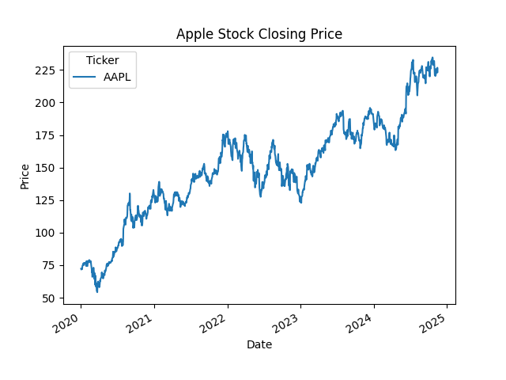
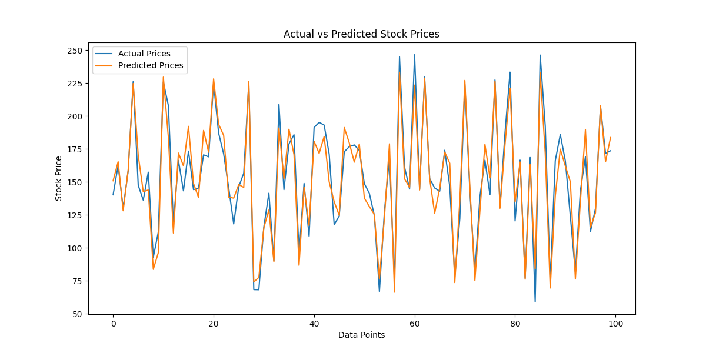

# Stock Price Prediction

A machine learning project that predicts stock prices using historical stock market data.

## Technologies Used
- Python
- Pandas
- NumPy
- Scikit-learn
- Matplotlib
- yFinance

## Features
- Historical stock data analysis
- Data preprocessing
- Feature engineering
- Linear Regression model
- Stock price prediction
- Data visualization

## Project Workflow
1. Download stock market data
2. Clean and preprocess data
3. Create prediction column
4. Train machine learning model
5. Predict future stock prices
6. Visualize prediction results

## Installation

bash
pip install -r requirements.txt

## Run Project

bash
python app.py

## Output Graphs

### Stock Price Graph

### Prediction Graph

## Future Improvements
- LSTM Deep Learning Model
- Real-time stock prediction
- Streamlit dashboard
- Multiple stock analysis

## Author
Kanika Gupta